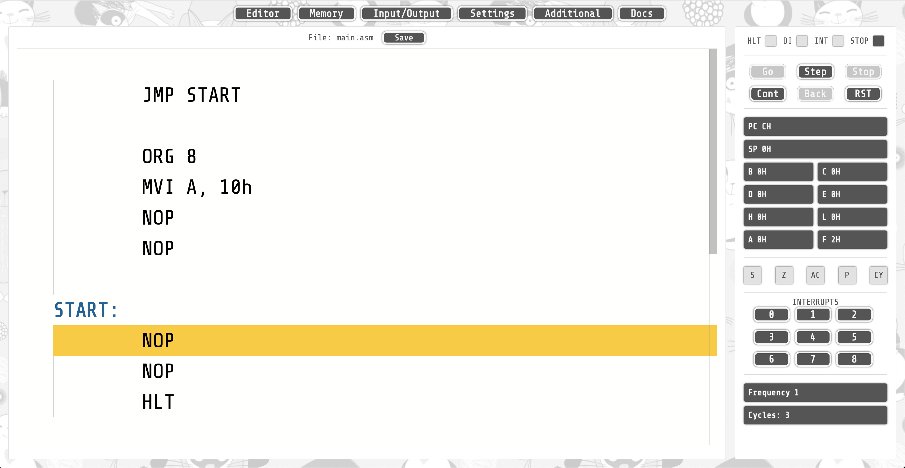

# Intel 8080 Core Emulator & Assembler & Debugger

Try it online available on this page.



## Quick start

Application (include emulator, assembler and debugger)
can work without any server or database service. Just
download source code, and run script. You need node
and yarn to download dependencies and run application.

```bash
$ git clone https//github.com/rokkerruslan/i8080 && cd i8080
$ ./app start
```

You see host/port when local dev server starts.

## Help for assembler language

todo: link on references

## Goals:

- Simple using Intel 8080 emulator.
- Historic assembler.
- Debugger.

## Non goals:

- Production ready platform
- Performance optimization

## Todo

- expressions evaluation
- collections page
- reverse debugger (step backward)
- i/o support

## Tests

Just run

```bash
$ ./app test
```

## Contributing

I don't know why, but if you want any pull requests are welcome :)
